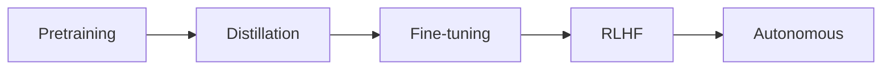

# Autonomous Video Editor

A complete AI-powered autonomous video editing system that combines reasoning, perception, and editing capabilities to automatically edit videos based on natural language prompts.

## 🚀 Features

### Core Capabilities
- **Autonomous Video Editing**: Edit videos using natural language prompts
- **Hybrid AI System**: Combines CodeLLaMA (reasoning), CLIP (vision), and Whisper (audio)
- **Advanced Effects**: 15+ professional video effects with GPU acceleration
- **Auto-Download**: Automatic model and dataset downloading
- **5-Phase Training**: Comprehensive training pipeline (pretraining → distillation → fine-tuning → RLHF → autonomous)
- **Production Ready**: Complete orchestration with validation and error handling

### Video Effects
- Fade in/out, zoom effects, color grading
- Cinematic effects, vintage film look
- Cyberpunk aesthetic, dramatic shadows
- Vibrant colors, film grain, vignette
- Motion blur, lens flare, and more

### Training Pipeline
1. **Pretraining**: Learn basic video understanding
2. **Distillation**: Compress knowledge from larger models
3. **Fine-tuning**: Task-specific adaptation with LoRA
4. **RLHF**: Human preference alignment
5. **Autonomous**: End-to-end autonomous editing

## 📋 Requirements

### System Requirements
- Python 3.8+
- CUDA-capable GPU (recommended for training)
- 16GB+ RAM (32GB recommended for training)
- 50GB+ storage for models and datasets

### Dependencies
```bash
# Core ML libraries
torch>=2.0.0
transformers>=4.30.0
opencv-python>=4.8.0
numpy>=1.24.0
pandas>=2.0.0

# Audio/Video processing
librosa>=0.10.0
moviepy>=1.0.3

# Training and optimization
accelerate>=0.20.0
deepspeed>=0.9.0
wandb>=0.15.0

# Optional enhancements
peft>=0.4.0  # For LoRA fine-tuning
bitsandbytes>=0.39.0  # For quantization
```

## 🛠 Installation

### 1. Clone the repository
```bash
git clone <repository-url>
cd auto_editor_prototype
```

### 2. Install dependencies
```bash
# Install core dependencies
pip install torch torchvision torchaudio --index-url https://download.pytorch.org/whl/cu118
pip install transformers opencv-python numpy pandas librosa moviepy
pip install accelerate deepspeed wandb tqdm requests

# Optional: Install advanced features
pip install peft bitsandbytes  # For LoRA and quantization
```

### 3. Setup the application
```bash
python autonomous_video_editor.py --setup
```

This creates necessary directories and prepares the environment.

## 🚀 Quick Start

### 1. Download models and datasets
```bash
# Download AI models (CodeLLaMA, CLIP, Whisper)
python autonomous_video_editor.py --download-models

# Download training datasets (WebVid, AudioSet, etc.)
python autonomous_video_editor.py --download-data
```

### 2. Train the model (optional)
```bash
# Run full 5-phase training pipeline
python autonomous_video_editor.py --train
```

### 3. Edit a video
```bash
# Edit with natural language prompt
python autonomous_video_editor.py \
    --edit-video /path/to/your/video.mp4 \
    --prompt "Make this video more cinematic with dramatic lighting" \
    --output edited_video.mp4
```

### 4. Run demo
```bash
# See effects in action with sample videos
python autonomous_video_editor.py --demo
```

## 💻 Usage Examples

### Basic Video Editing
```python
from src.inference.autonomous_editor import quick_edit

# Simple editing with prompt
result = quick_edit(
    video_path="input.mp4",
    prompt="Add cinematic color grading and fade effects",
    output_path="output.mp4"
)
```

### Advanced Usage
```python
from autonomous_video_editor import AutonomousVideoEditorApp

# Initialize with custom config
app = AutonomousVideoEditorApp(config={
    'effects': {'quality': 'ultra', 'gpu_acceleration': True},
    'model': {'backbone': 'codellama/CodeLlama-7b-hf'}
})

app.setup()
app.load_model("path/to/trained/model.pt")

# Edit multiple videos
videos = ["video1.mp4", "video2.mp4", "video3.mp4"]
for video in videos:
    app.edit_video(
        video_path=video,
        prompt="Create a vintage film aesthetic with warm tones",
        output_path=f"edited_{video}"
    )
```

### Batch Processing
```python
from src.inference.autonomous_editor import batch_process_videos

# Process multiple videos with same style
batch_process_videos(
    video_paths=["video1.mp4", "video2.mp4"],
    prompt="Apply cyberpunk aesthetic with neon colors",
    output_dir="edited_videos/"
)
```

## 🎨 Available Effects

| Effect | Description |
|--------|-------------|
| `fade_in` | Smooth fade from black |
| `fade_out` | Smooth fade to black |
| `zoom_in` | Gradual zoom effect |
| `zoom_out` | Reverse zoom effect |
| `color_grade_cinematic` | Professional color grading |
| `vintage_film` | Classic film look with grain |
| `cyberpunk` | Sci-fi neon aesthetic |
| `dramatic_shadows` | Enhanced contrast and shadows |
| `vibrant_colors` | Increased saturation |
| `warm_tones` | Warm color temperature |
| `cool_tones` | Cool color temperature |
| `film_grain` | Analog film texture |
| `vignette` | Edge darkening effect |
| `motion_blur` | Directional blur effect |
| `lens_flare` | Light lens artifacts |

## 🔧 Configuration

### Model Configuration
```python
MODEL_CONFIG = {
    'backbone': 'microsoft/DialoGPT-small',  # Main reasoning model
    'vision_encoder': 'openai/clip-vit-base-patch32',  # Vision understanding
    'audio_encoder': 'openai/whisper-tiny',  # Audio processing
    'text_dim': 768,
    'vision_dim': 512,
    'audio_dim': 512,
    'fusion_dim': 1024,
    'hidden_dim': 2048
}
```

### Training Configuration
```python
TRAINING_CONFIG = {
    'batch_size': 4,
    'learning_rate': 1e-4,
    'num_epochs': 10,
    'bf16': True,  # Use bfloat16 for efficiency
    'gradient_accumulation_steps': 4,
    'phases': {
        'pretraining': {'enabled': True, 'epochs': 3},
        'distillation': {'enabled': True, 'epochs': 2},
        'fine_tuning': {'enabled': True, 'epochs': 3},
        'rlhf': {'enabled': True, 'epochs': 2},
        'autonomous': {'enabled': True, 'epochs': 2}
    }
}
```

### Dataset Configuration
```python
DATASET_CONFIG = {
    'auto_download': True,
    'webvid': {'enabled': True, 'samples': 10000},
    'audioset': {'enabled': True, 'samples': 5000},
    'activitynet': {'enabled': True, 'samples': 5000}
}
```

## 🏗 Architecture

### Core Components

1. **HybridVideoAI** (`src/core/hybrid_ai.py`)
   - Main AI system combining reasoning, vision, and audio
   - Multimodal fusion and video understanding
   - Editing plan generation

2. **AdvancedEffectGenerator** (`src/generation/effect_generator.py`)
   - Professional video effects with GPU acceleration
   - Real-time processing capabilities
   - Extensible effect system

3. **ModelDownloader** (`src/utils/model_downloader.py`)
   - Automatic HuggingFace model downloading
   - Caching and fallback systems
   - Model validation and cleanup

4. **DatasetAutoDownloader** (`src/utils/dataset_downloader.py`)
   - Automatic dataset fetching and processing
   - Support for WebVid, AudioSet, ActivityNet, etc.
   - Progress tracking and resume capability

5. **TrainingOrchestrator** (`src/training/training_orchestrator.py`)
   - Complete 5-phase training pipeline
   - Automatic setup and validation
   - Comprehensive error handling

6. **AutonomousVideoEditor** (`src/inference/autonomous_editor.py`)
   - High-level editing interface
   - Natural language prompt processing
   - Video I/O and processing

### Training Phases



1. **Pretraining**: Learn basic video understanding on large datasets
2. **Distillation**: Compress knowledge from larger teacher models
3. **Fine-tuning**: Task-specific adaptation using LoRA
4. **RLHF**: Align with human preferences for editing quality
5. **Autonomous**: End-to-end autonomous editing training

## 📊 Performance

### Hardware Recommendations

| Component | Minimum | Recommended | Optimal |
|-----------|---------|-------------|---------|
| GPU | GTX 1060 6GB | RTX 3080 12GB | RTX 4090 24GB |
| RAM | 16GB | 32GB | 64GB |
| Storage | 50GB | 100GB | 200GB SSD |
| CPU | 4 cores | 8 cores | 16+ cores |

### Processing Speed
- **Effect Application**: ~30-60 FPS (1080p, RTX 3080)
- **AI Inference**: ~5-15 FPS (depending on model size)
- **Training**: ~2-8 hours per phase (RTX 4090, 10K samples)

## 🔍 Troubleshooting

### Common Issues

**1. CUDA Out of Memory**
```bash
# Reduce batch size or use gradient accumulation
export CUDA_VISIBLE_DEVICES=0
python autonomous_video_editor.py --train --config small_config.json
```

**2. Model Download Fails**
```bash
# Clear cache and retry
rm -rf models/cache/*
python autonomous_video_editor.py --download-models
```

**3. Import Errors**
```bash
# Install missing dependencies
pip install -r requirements.txt
```

**4. Video Processing Errors**
```bash
# Check video format and codec
ffmpeg -i input.mp4  # Check video info
```

### Performance Optimization

**Enable GPU Acceleration:**
```python
config = {
    'effects': {'gpu_acceleration': True},
    'training': {'bf16': True, 'gradient_checkpointing': True}
}
```

**Memory Optimization:**
```python
config = {
    'training': {
        'gradient_accumulation_steps': 8,
        'batch_size': 2,
        'dataloader_num_workers': 2
    }
}
```

## 🤝 Contributing

### Development Setup
```bash
# Install development dependencies
pip install -e .
pip install black flake8 pytest

# Run tests
python -m pytest tests/

# Format code
black src/ tests/
```

### Adding New Effects
```python
# In src/generation/effect_generator.py
def apply_my_custom_effect(self, frame: np.ndarray, **kwargs) -> np.ndarray:
    # Implement your effect
    return processed_frame
```

### Adding New Datasets
```python
# In src/utils/dataset_downloader.py
def download_my_dataset(self):
    # Implement dataset download and processing
    pass
```

## 📄 License

This project is licensed under the MIT License - see the [LICENSE](LICENSE) file for details.

## 🙏 Acknowledgments

- HuggingFace Transformers for model infrastructure
- OpenAI for CLIP and Whisper models
- Meta for CodeLLaMA
- OpenCV community for video processing
- All dataset creators and contributors

## 📞 Support

For issues and questions:
1. Check the [troubleshooting section](#-troubleshooting)
2. Search existing [GitHub issues](issues)
3. Create a new issue with detailed information

---

**Made with ❤️ for the video editing community**

**Key Capabilities:**
- Understanding video like a human editor – narrative, emotions, rhythm, style
- Learning continuously – from new videos, edits, and user feedback  
- Writing its own code – to generate transitions, effects, shaders, or editing algorithms
- Expanding knowledge – adapting to any editing genre: cinematic, AMVs, phonk, sports, comedy, documentaries
- Becoming an autonomous agent – capable of professional-level video creation

We're not just connecting tools like a conductor — we're fusing them into one hybrid AI model that learns the capabilities of Whisper, RT-DETR, CLIP, etc. inside a single unified brain.ous AI Video Editor
🌌 Vision
This project is not just a video editor — it’s a self-thinking, self-learning, and self-improving AI system capable of:
Understanding video like a human editor – narrative, emotions, rhythm, style.
Learning continuously – from new videos, edits, and user feedback.
Writing its own code – to generate transitions, effects, shaders, or even new editing algorithms.
Expanding knowledge – adapting to any editing genre: cinematic, AMVs, phonk, sports, comedy, documentaries, etc.
Becoming an autonomous agent – capable of professional-level video creation with minimal human input.

We’re not just connecting tools like a conductor (orchestrator) — we’re trying to fuse them into one hybrid AI model, so it doesn’t just use Whisper, YOLO, SAM, etc. separately, but actually learns their capabilities inside a single unified brain.
That means:
Fine-tuning / Multi-modal fusion → train an AI that natively understands video (vision + audio + text + editing logic).
Knowledge distillation → compress the knowledge of many specialized models into one hybrid foundation model.
Self-improving → the fused AI keeps training itself, not just switching between external tools.
-----------------------------------------------------------------------------------------------------------------------

🧠 Hybrid AI Stack
1. Reasoning & Core Brain
CodeLLaMA 34B (fine-tuned) – For reasoning + code generation.
GPT-NeoX – Large transformer backbone.
Mixtral-8x7B / DeepSeek-MoE – Efficient Mixture-of-Experts reasoning + code-writing.
Transformers Library – Model orchestration.
AutoCoder Engine – Writes/refactors Python, GLSL, and FFmpeg scripts for new effects.
2. Perception & Analysis Layer
RT-DETR – Real-time transformer-based object detection.
SigLIP / EVA-CLIP – State-of-the-art vision-language understanding.
HQ-SAM / MobileSAM – High-quality segmentation & masking.
MediaPipe – Face & landmark analysis.
VideoMAE v2 – Temporal transformer for scene activity & motion understanding.
3. Audio Intelligence
Distil-Whisper + MMS – Scalable multilingual speech recognition & subtitles.
Hybrid BeatNet – Transformer-based beat and tempo analysis.
Demucs v4 – Music/speech source separation.
CREPE – Pitch + vocal melody extraction.
MusicLM Embeddings – Music understanding and genre context.
4. Video Editing Core
FFmpeg – Rendering, video processing backbone.
MoviePy – Timeline and composition.
RAFT Optical Flow – Smooth motion interpolation.
HDRNet (Google) – Automatic cinematic color correction.
Diffusion Video Transformers (AnimateDiff v3 / DynamiCrafter) – High-quality AI-driven video edits.
5. Content Generation
Stable Diffusion XL + ControlNet – Frame/overlay generation.
AnimateDiff v3 + DynamiCrafter – Video generation from prompts with temporal consistency.
DreamGaussian / 4D Gaussian Surfels – Experimental 3D/CGI elements.
6. Self-Learning Loop
DPO (Direct Preference Optimization) – More stable training from feedback.
VBench – Automatic multi-metric video quality scoring.
RLHF – AI improves by comparing versions.
Knowledge Expansion – Periodic re-training on new datasets (AMVs, movie edits, sports highlights, etc.).
📊 Capabilities
Autonomous Planning – AI generates an editing plan from a text prompt.
Beat-Synced Cuts – Perfect sync to music drops (phonk, AMV, reels).
Code-Generated Effects – AI writes its own transitions, shaders, overlays.
Narrative Understanding – Cuts and pacing based on emotion and storytelling.
Genre Mastery – Learns new styles from data (TikTok edits, trailers, anime, films).
Self-Improvement – Reviews its output and improves effects over time.
Unified Understanding: One model that sees, hears, and understands video/audio in context.
Autonomous Editing: Generates full edit timelines from a prompt.
Code-Writing Power: Can produce new effect/transitions if not in its learned library.
Self-Learning: Expands its editing knowledge continuously.
Scalable Knowledge: Learns from millions of videos → masters all editing styles.
can handle mutliple heavy timelines at a time
can make a 10-20 sec reel with hundreads of transitions, effects, filters, audio and timelines at a time one upon other and more.
-----------------------------------------------------------------------------------------------------------------------

🛠 Tools for Fusion Training
PyTorch + Hugging Face Transformers – training core.
DeepSpeed / FSDP – distributed training for huge multimodal models.
LoRA / QLoRA / UniAdapter – parameter-efficient multi-modal fusion.
Progressive Distillation – step-by-step compression of expert models.
OpenCLIP / SigLIP – strong vision-language embeddings.
TorchAudio + TorchVision + decord – video/audio pipeline.
Weights & Biases / MLflow – experiment tracking.
⚡ Training Roadmap
Phase 1 – Fusion Pretraining
Train multimodal embedding space with WebVid-10M + AudioSet + text captions.
Phase 2 – Distillation
Distill knowledge from RT-DETR (objects), HQ-SAM (masks), Whisper-MMS (speech).
Compress into hybrid core.
Phase 3 – Editing Fine-Tuning
Train on AMV, cinematic trailers, TikTok edit datasets.
Align outputs with editing tokens (cut, transition, color-grade, sync).
Phase 4 – Self-Improvement
Add reinforcement loop: AI critiques and improves its edits.
Expand code-writing ability (auto-generate FFmpeg/GLSL transitions).
Phase 5 – Autonomous Hybrid AI
Single fused model capable of understanding, editing, generating, and learning.
-----------------------------------------------------------------------------------------------------------------------


🔮 Future Directions
Neural Rendering Fusion – add text-to-3D and CGI pipelines.
Meta-Learning – AI studies film editing books, tutorials, essays.
Global Trends Model – learns editing styles from viral TikToks and YouTube edits.
Collaborative Agent – works with human editors interactively.

🔄 Final Fusion Order Summary
Reasoning brain → fuse LLaMA, Mistral, GPT-NeoX into DeepSeek-MoE.
Vision fusion → distill RT-DETR + HQ-SAM + VideoMAE into backbone.
Audio fusion → distill Whisper + MMS + MusicLM embeddings.
Editing core → fine-tune on editing tokens, distill RAFT + HDRNet.
Content generation → distill SDXL + AnimateDiff + DreamGaussian.
Self-learning → add RLHF/DPO + auto-retraining loop.